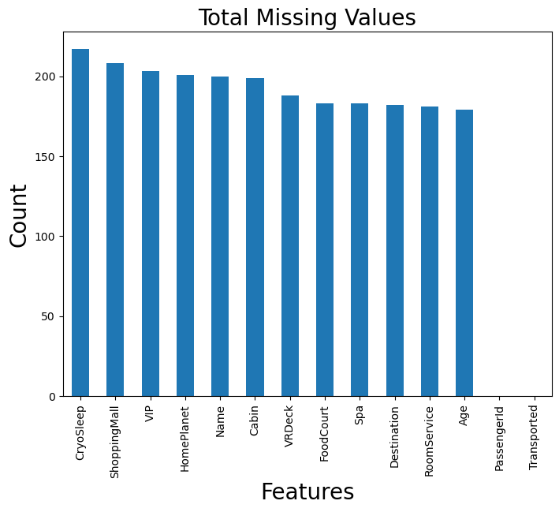

# Project for honors on Exploratory Data Analysis IBM Course

## Objetivo

Identificar padrões no dataset que me permita **inferir sobre os motivos de um passageiro ter sido aciedentalmente transportado pra outra dimensão** por efeito da colisão da nave com uma nuvem de poeira.

## Steps Summary

#### Identificar distribuição dos dados

- Teste de Shapiro-Wilk ou Kolmogorov-Smirnov
- Q-Q Plot (Gráfico de Probabilidade Quantil-Quantil)

#### Tratar Duplicated Data

- Data Filtering
- Drop duplicated values
  
#### Tratar Missing Data

- Data Filtering
- Drop missing values
- Input mean values in missing values

#### Tratar Outliers

- Z-Score
- Boxplot

#### Identificar Correlação entre as features e visualizar tal correlação

- Pair plots
- Scatter plots
- Heat Maps
- Correlation Matrixes
- corr() function
- Regressão Linear Simples
- Análise de Resíduos
- Agrupamento de dados
- Data Filtering
- pairplot.express pandas library

#### Normalizar Dados

- Box-Cox Transform: work with skewed data
- Log Transformation
 
#### Feature Scalling

- MinMax Scalling
- Standard Scalling

#### Feature Encoding

- Binary Enconding
- One-hot Encoding
- Ordinal Enconding

#### Revisar correlação de dados para verificar se ainda existe

- Pair plots
- Scatter plots
- Heat Maps
- Correlation Matrixes
- corr() function
- Regressão Linear Simples
- Análise de Resíduos

#### Tratar dados utilizando Polynomial Syntax se identificar necessidade

#### Revisar se Polynomial Syntax foi aplicada corretamente

#### Identificação das 3 hipóteses

- Identificar Distribuição
- Identificar as hipóteses
- Identificar Nível de Significância (α)
- Cálculo Estatístico do Teste (LikeliHood Ratio Test)
- Cálculo do p-valor para afirmar ou refutrar hipótese nula


# Start EDA

## Duplicated Values

```python
duplicated_data = initial_df[initial_df.duplicated(['HomePlanet', 'CryoSleep', 'Cabin', 'Destination', 'Age', 'VIP', 'Name', 'Transported'])]
duplicated_data.head()

initial_df.index.is_unique
True
```

O comportamento do método .head() ao mostrar nenhum dado duplicado e o retorno True da afirmativa is_unique identifica que não há dados duplicados no dataset.

## Missing Values
```python
total_null = initial_df.isnull().sum>sort_values(ascending=False)
total_null

total_null.plot(kind="bar", figsize = (8, 6), fontsize = 10)
plt.xlabel("Features", fontsize = 20)
plt.ylabel("Count", fontsize = 20)
plt.title("Total Missing Values", fontsize = 20)
```


Este é um gráfico de barra que representa quantos valores nulos existem em cada conjunto de dados de uma feature. Para ser mais preciso, faltam a seguinte quantidade pra cada featrure:
```python
CryoSleep       217
ShoppingMall    208
VIP             203
HomePlanet      201
Name            200
Cabin           199
VRDeck          188
FoodCourt       183
Spa             183
Destination     182
RoomService     181
Age             179
PassengerId       0
Transported       0
dtype: int64
```

As linhas de dados que possuem valores nulos nas seguintes colunas: CryoSleep, HomePlanet e Cabin **foram apagadas**, pois são informações que possuem potencial caráter preditivo sobre a variável target. Além disso, são dados categóricos, o que dificulta a substituição por valores constantes que poderiam introduzir vieses ou ruído no modelo.

```python
initial_df.dropna(subset=["CryoSleep", "HomePlanet", "Cabin"])
```

## Handling with Outliers
O dataset que identifica os passageiros do Spaceship Titanic possui majoritariamente variáveis categóricas, inclusive elas provavelmente são as que mais podem ajudar a prever a variavel target. Sendo assim, não há Outliers a serem tratados no dataset até o momento.

#### Análise do padrão de consumo dos serviços

O gráfico mostra que os passageiros que consumiram mais que 5000 em serviços oferecidos no Spaceship Titanic ultrapassaram muito do normal de consumo.

## Identificando Correlação entre as features

#### Análise de frequência das features

```python
# Quantidade de passageiros transportados
initial_df['Transported'].value_counts()

Transported
True     4378
False    4315
Name: count, dtype: int64

# Passageiros de cada HomePlanet
initial_df['HomePlanet'].value_counts()

HomePlanet
Earth     4602
Europa    2131
Mars      1759
Name: count, dtype: int64

# Passageiros que estavam no CryoSleep
initial_df['CryoSleep'].value_counts()

CryoSleep
False    5439
True     3037
Name: count, dtype: int64

# Passageiros em cada cabine
count_P = initial_df['Cabin'].str.endswith('P').sum()
count_P

4206

count_S = initial_df['Cabin'].str.endswith('S').sum()
count_S

4288

# Passageiros VIP
initial_df['VIP'].value_counts()

VIP
False    8291
True      199
Name: count, dtype: int64

# Destination
initial_df['Destination'].value_counts()

Destination
TRAPPIST-1e      5915
55 Cancri e      1800
PSO J318.5-22     796
Name: count, dtype: int64
```

### Análise da Correlação entre Transported e CryoSleep


O gráfico nos indica que a variável CryoSleep e a variável Transported são as que mais possuem correlação entre as exibida.


